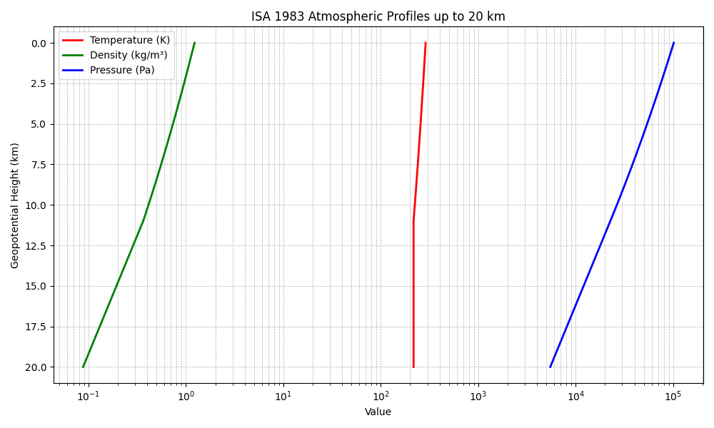

==================================================
ISA 1983 Atmospheric Profiles Example
==================================================

This tutorial demonstrates how to use the **Isadora** package to:

- Compute atmospheric properties at selected altitudes.
- Compute derived quantities like dynamic pressure and Mach number.
- Apply temperature offsets.
- Plot temperature, pressure, and density profiles up to 20 km.

.. note::

   All quantities are computed assuming **geopotential altitude** and using SI units by default. Unit conversions are supported.

Example Script
--------------

The following Python script, ``examples.py``, demonstrates the features:

.. code-block:: python

    import os, sys
    import matplotlib.pyplot as plt
    import numpy as np

    sys.path.insert(0, os.path.abspath(os.path.join(os.path.dirname(__file__), "..")))
    from isadora import ISA
    from isadora.units import UnitRegistry

    # Set preferred unit system
    UnitRegistry.set_unit_standard("SI")

    # Selected altitudes
    altitudes = [0.0, 5.0, 10.0, 15.0, 20.0]
    isa_objects = [ISA(geopotential_height=h) for h in altitudes]

    # Display ISA properties
    for isa in isa_objects:
        h = isa.altitude
        print(f"--- Geopotential Height: {h} km ---")
        print(f"Temperature: {isa.temperature}")
        print(f"Pressure: {isa.pressure}")
        print(f"Density: {isa.density}")
        print(f"Dynamic viscosity: {isa.dynamic_viscosity}")
        print(f"Kinematic viscosity: {isa.kinematic_viscosity}")
        print(f"Speed of sound: {isa.speed_of_sound}")
        print(f"Atmospheric layer: {isa.atmosphere}")

    # Aircraft properties at 10 km
    velocity = 250.0  # m/s
    atm_10km = ISA(geopotential_height=10.0)
    q = atm_10km.dynamic_pressure(velocity)
    M = atm_10km.mach_number(velocity)
    print("\n=== Aircraft Flight Properties at 10 km (250 m/s) ===")
    print(f"Dynamic pressure: {q}")
    print(f"Mach number: {M:.2f}")

    # Temperature offset example (+5 K)
    isa_offset = ISA(geopotential_height=10.0, offset=5.0)
    print("\n=== Temperature Offset Example (+5 K) ===")
    print(f"Temperature at 10 km with offset: {isa_offset.temperature} K")
    print(f"Layer with offset: {isa_offset.atmosphere}")

    # -------------------------------
    # Corrected plotting of ISA profiles up to 20 km
    # -------------------------------
    h_profile = np.linspace(0, 20, 201)  # 0 to 20 km in 0.1 km steps
    T_profile = []
    P_profile = []
    rho_profile = []

    for h in h_profile:
        isa_h = ISA(geopotential_height=h)
        T_profile.append(isa_h.temperature.value)
        P_profile.append(isa_h.pressure.value)
        rho_profile.append(isa_h.density.value)

    plt.figure(figsize=(10, 6))

    # Plot Temperature (linear)
    plt.plot(T_profile, h_profile, label="Temperature (K)", color="red", linewidth=2)
    # Plot Density (linear)
    plt.plot(rho_profile, h_profile, label="Density (kg/m³)", color="green", linewidth=2)
    # Plot Pressure (log scale for better visibility)
    plt.plot(P_profile, h_profile, label="Pressure (Pa)", color="blue", linewidth=2)
    plt.xscale("log")

    # Invert y-axis so sea level is at bottom
    plt.gca().invert_yaxis()

    plt.xlabel("Value")
    plt.ylabel("Geopotential Height (km)")
    plt.title("ISA 1983 Atmospheric Profiles up to 20 km")
    plt.grid(True, which="both", linestyle="--", linewidth=0.5)
    plt.legend()
    plt.tight_layout()
    plt.show()

Command-Line Output
------------------

Run the script with:

.. code-block:: bash

    python examples.py

The expected command-line output is:

.. code-block:: text

    === ISA Properties at Selected Altitudes ===

    --- Geopotential Height: 0.0 km ---
    Temperature: 288.15 K
    Pressure: 101325.0 Pa
    Density: 1.2250000010542619 kg/m3
    Dynamic viscosity: 1.7894e-05 kg/(m*s)
    Kinematic viscosity: 1.4607346926204106e-05 m**2/s
    Speed of sound: 340.29399039703884 m/s
    Atmospheric layer: ISA Troposhere(0.0 km)

    --- Geopotential Height: 5.0 km ---
    Temperature: 255.64999999999998 K
    Pressure: 54019.888661612255 Pa
    Density: 0.7361155435934009 kg/m3
    Dynamic viscosity: 1.6281356844719354e-05 kg/(m*s)
    Kinematic viscosity: 2.2117936493014045e-05 m**2/s
    Speed of sound: 320.52939667578073 m/s
    Atmospheric layer: ISA Troposhere(5.0 km)

    --- Geopotential Height: 10.0 km ---
    Temperature: 223.14999999999998 K
    Pressure: 26436.243087647996 Pa
    Density: 0.412706155163577 kg/m3
    Dynamic viscosity: 1.4571246406450602e-05 kg/(m*s)
    Kinematic viscosity: 3.5306588535553236e-05 m**2/s
    Speed of sound: 299.46316696104714 m/s
    Atmospheric layer: ISA Troposhere(10.0 km)

    --- Geopotential Height: 15.0 km ---
    Temperature: 216.65 K
    Pressure: 12044.563506261342 Pa
    Density: 0.19367362129659876 kg/m3
    Dynamic viscosity: 1.4216287481625591e-05 kg/(m*s)
    Kinematic viscosity: 7.340332352155617e-05 m**2/s
    Speed of sound: 295.06949556492617 m/s
    Atmospheric layer: ISA Tropopause(15.0 km)

    --- Geopotential Height: 20.0 km ---
    Temperature: 216.65 K
    Pressure: 5474.882347734884 Pa
    Density: 0.08803476272987591 kg/m3
    Dynamic viscosity: 1.4216287481625591e-05 kg/(m*s)
    Kinematic viscosity: 0.00016148492982535274 m**2/s
    Speed of sound: 295.06949556492617 m/s
    Atmospheric layer: ISA Tropopause(20.0 km)

    === Aircraft Flight Properties at 10 km (250 m/s) ===
    Dynamic pressure: 12897.067348861781 Pa
    Mach number: 0.83

    === Temperature Offset Example (+5 K) ===
    Temperature at 10 km with offset: 228.14999999999998 K K
    Layer with offset: ISA Troposhere(10.0 km)

.. note::

   The plot shows:

   - **Red:** Temperature profile (K)
   - **Green:** Density profile (kg/m³)
   - **Blue:** Pressure profile (Pa, log scale)
   - **Y-axis:** Geopotential height (km, sea level at bottom)
